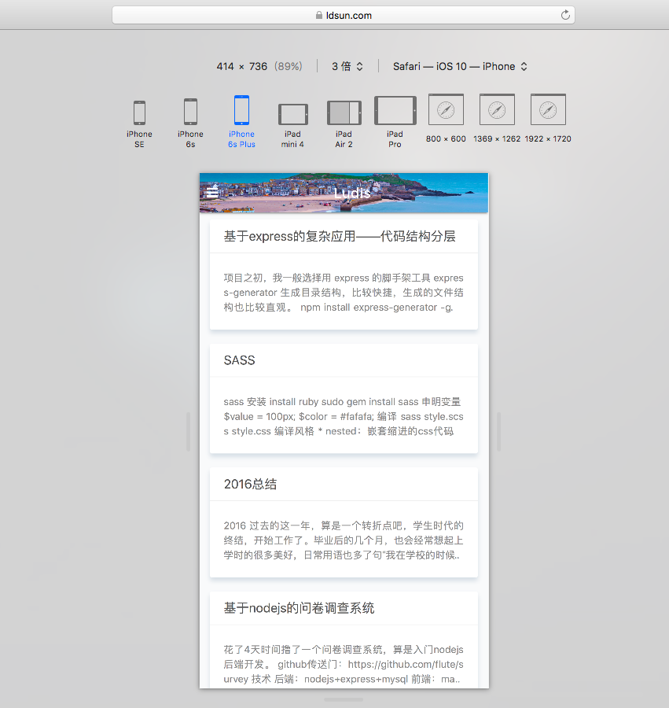
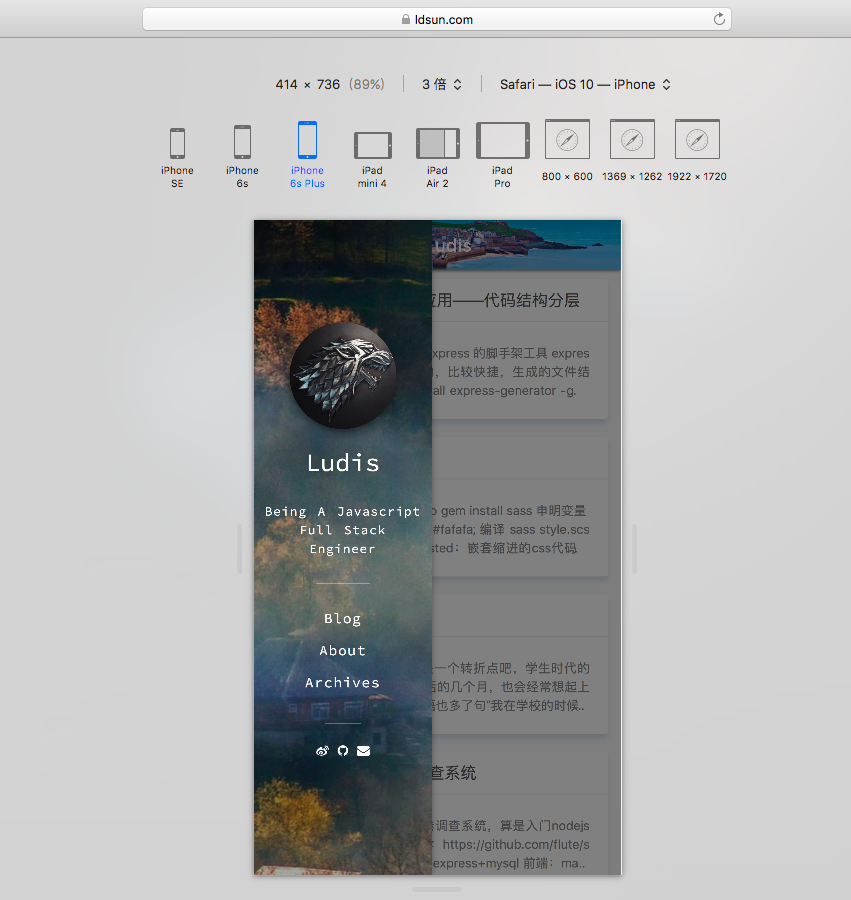
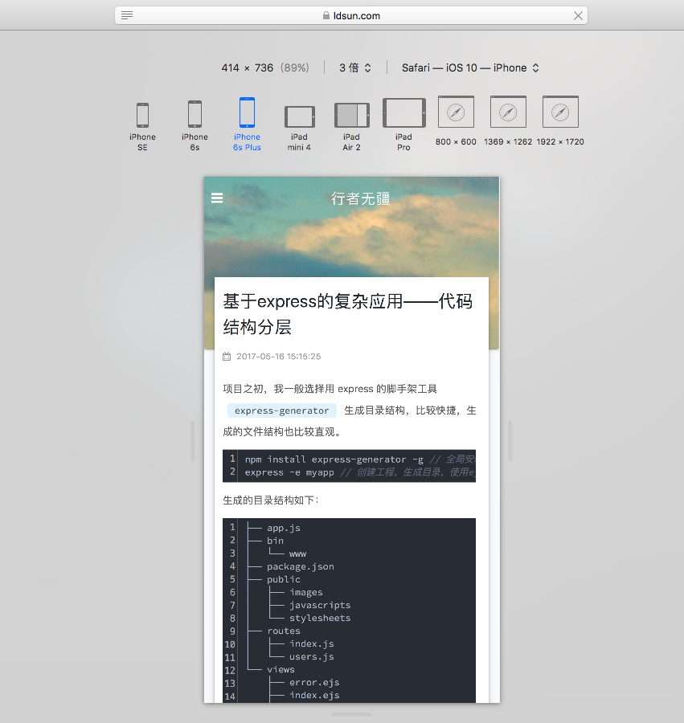
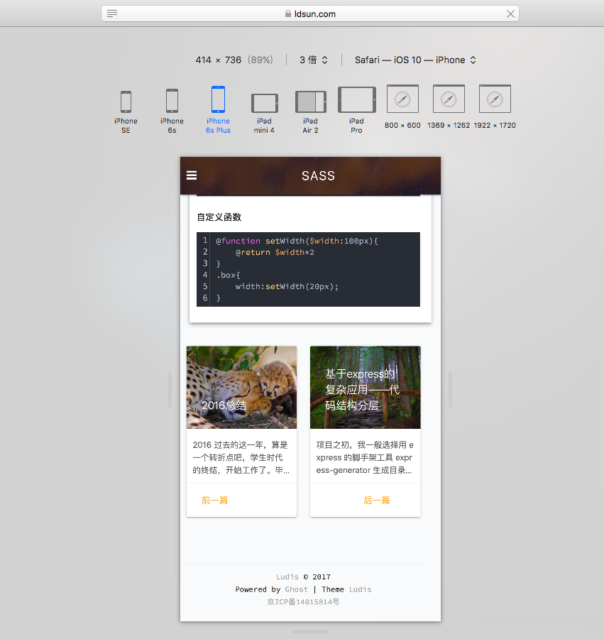
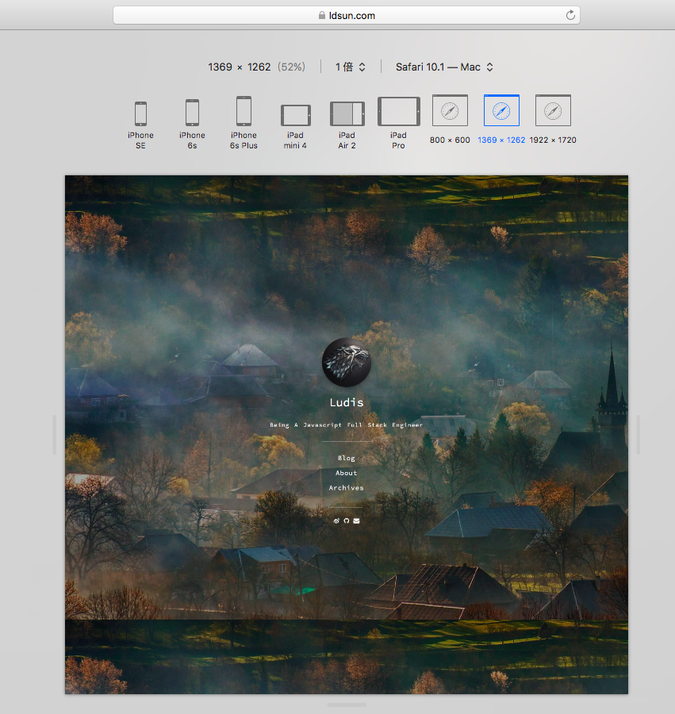
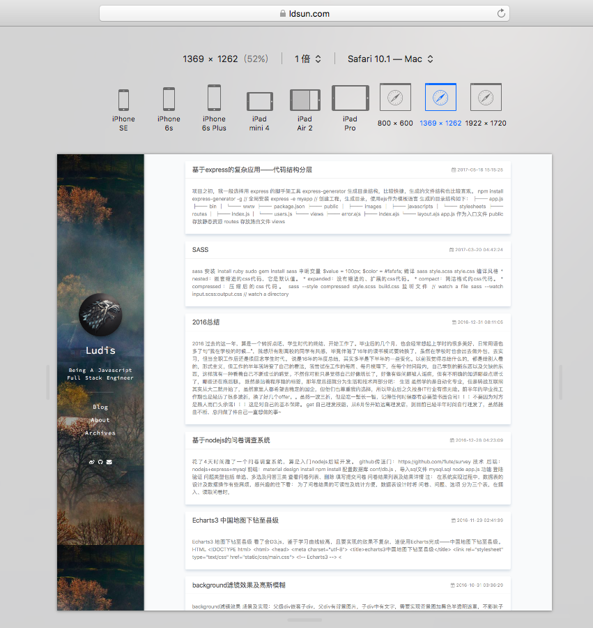
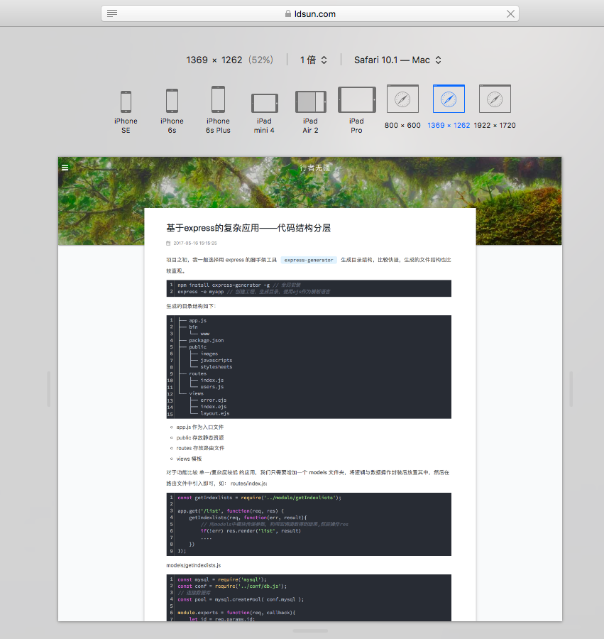
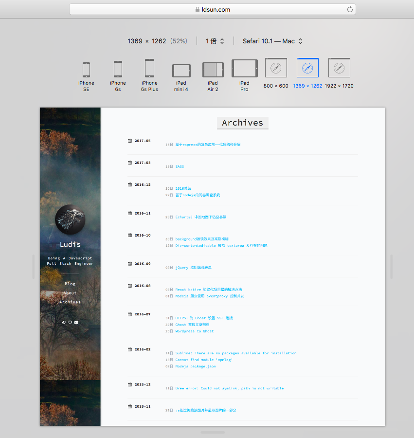

# skywalker

一款material design风格的响应式简约ghost博客主题

[demo](https://www.ldsun.com)

### 安装使用

1. 下载主题压缩包，上传至ghost博客的content/themes/skywalker中，解压，重启ghost系统，然后在后台设置启用主题即可。
2. 也可以在ghost博客的content/themes/skywalker目录下，执行`git clone git@github.com:flute/skywalker.git`,然后重启ghost系统，然后在后台设置启用主题即可。
3. about、archives页面需在后台新建两个page，设置页面URL，并在Design->Navigation中按照“显示名称-链接”添加两个页面

### 主题说明

* 适配移动端和pc端
* 随机获取bing图库图片作为背景图 https://github.com/flute/img
* 新增ghost博客文章归档页面
* ~~使用disqus作为评论插件，可自行替换~~ 使用畅言作为评论系统，修改样式屏蔽广告。
* 主题采用flexbox布局
* markdown样式与github相同，代码高亮使用highlight.js

### Screenshoot
* mobile：

  
  

* pc

持续更新中，欢迎使用+star/fork。。。
